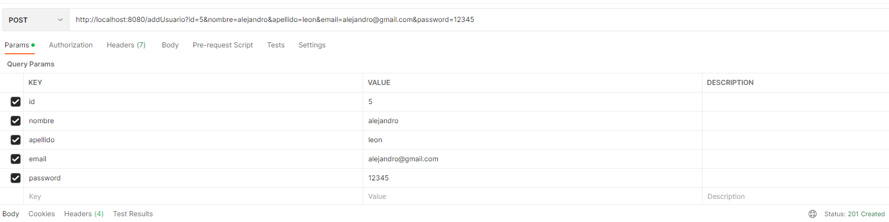
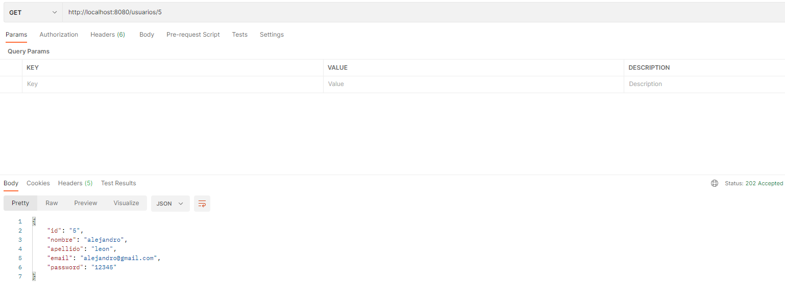
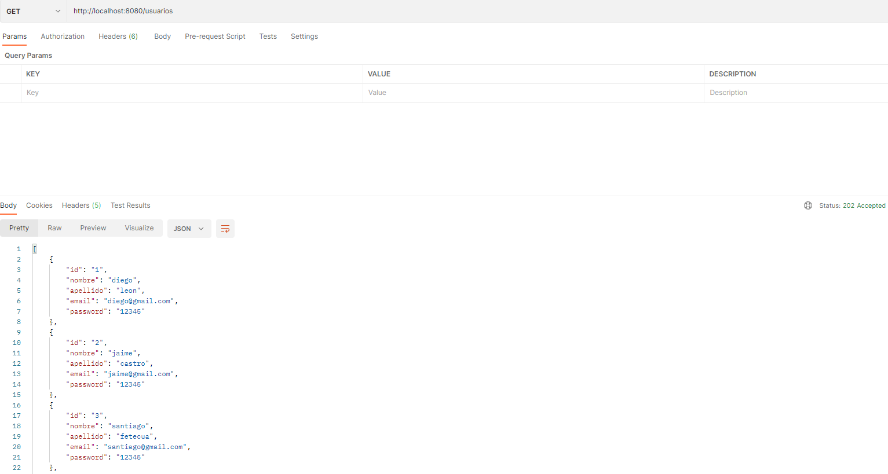
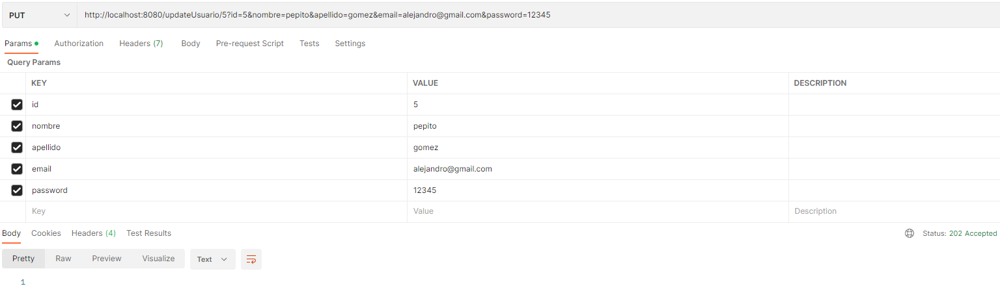
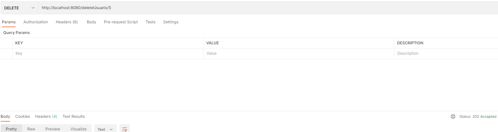

### Escuela Colombiana de Ingeniería

### IETI - Sprint 2: Persistencia y Seguridad API REST

#### Descripción

Esta aplicación permite crear, obtener, actualizar y eliminar usuarios y libros de un cluster de MongoDB.

##### Usuarios

- Crear un usuario

- Obtener un usuario

- Obtener todos los usuarios

- Actualizar un usuario

- Eliminar un usuario

#### Integrantes

- Diego Leon
- Jaime Castro
- Santiago Fetecua
- Juan David Martinez